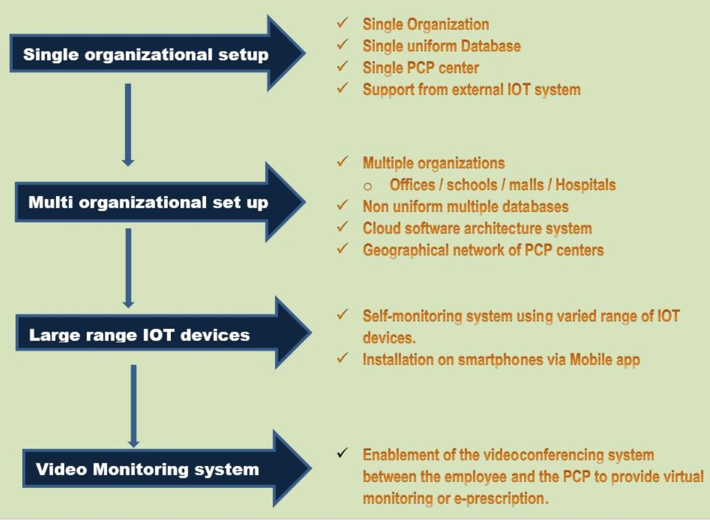

# Project - SURAKSHA360
## Team HackVID-19
#### Women Co(vi)d Hackathon - Submission

## Description

<b>SURAKSHA360</b> can be used by the organizations to screen and identify every employee that enters their premise on the basis of his unstable vital sign readings .Any of such employee is to be monitored by a physician with whom the organization has collaboration and if required may be diagnosed by him to be isolated from the other population and be suggested to stay / work at home.

## Suraksha Process Flow

#### A high level overview of how the process will work.

## Solution Roadmap

## Creators -
* Sonal Garg
* Nidhi Aggarwal
* Anukrati Chauhan
* Shipra Gupta
* Nidhi Rana

